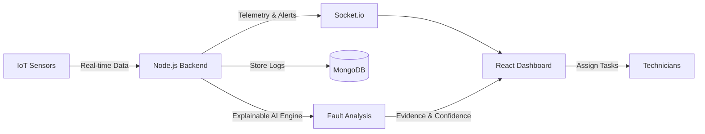

<div align="center">
  
  <h1>PoleNova AI</h1>
  <p><b>Build. Automate. Analyze. Ship. — AI-powered real-time fault intelligence for rural electricity distribution networks.</b></p>
  
  [](https://opensource.org/licenses/MIT)
</div>

---

## ✨ Overview
PoleNova AI brings modern telemetry and intelligence to rural power grids. By deploying low-cost IoT sensors on poles, PoleNova collects real-time voltage, current, and temperature data. Our explainable AI engine continuously analyzes this data, instantly detecting faults, identifying the specific line segment affected, and explaining the probable cause to operators.

## 🎯 Problem Statement
Rural electricity distribution networks are notoriously difficult to monitor. Operators typically discover faults only after a customer calls to report an outage, or when technicians manually drive out to inspect infrastructure over vast distances. This reactive approach leads to massive downtime, safety risks, and increased operational costs.

## 💡 Solution
PoleNova AI provides a proactive approach by implementing a **Live Digital Twin** of the distribution network. Using continuous telemetry visualization and automated comparative analysis, it alerts operators the second a fault occurs, vastly reducing downtime and streamlining technician dispatch.

## 🚀 Key Features
- ⚡ **Live Digital Twin**: Real-time Socket.io telemetry visualization of your entire feeder network.
- 🤖 **Explainable AI Detection**: Adjacent-pole comparative analysis isolates faults with a human-readable evidence trail and confidence score.
- 📊 **Analytics Dashboard**: Built-in visual dashboards for historical severity and root-cause tracking.
- 🔎 **Fault Lifecycle Management**: Track faults from detection, to technician assignment, to resolution.
- 📱 **Interactive Demo Mode**: Built-in scenario controller to simulate broken wires, transformer overheating, and voltage instability live.

## 🧠 How It Works



## 🛠️ Tech Stack

| Category | Technology |
| :--- | :--- |
| **Frontend** | React 18, Vite, TailwindCSS, Framer Motion, Recharts |
| **Backend** | Node.js, Express.js, Socket.io, JWT Authentication |
| **Database** | MongoDB, Mongoose |
| **Language** | JavaScript (ES6+) |
| **Styling** | Vanilla CSS, TailwindCSS |

## 📂 Project Structure

```text
polenova-ai-hackathon/
├── backend/                  # Node.js Express server API
│   ├── config/               # Database and environment configurations
│   ├── controllers/          # API route logic and controllers
│   ├── models/               # Mongoose schemas (User, Pole, Fault, etc.)
│   ├── routes/               # Express routing definitions
│   ├── services/             # Background services and AI Fault Detection logic
│   └── socket/               # WebSockets implementation
├── frontend/                 # React frontend application
│   ├── src/                  # React source code, components, and pages
│   ├── index.html            # Entry HTML file
│   └── vite.config.js        # Vite bundler configuration
├── docs/                     # API and Architecture documentation
├── LICENSE                   # MIT License
└── README.md                 # Project documentation
```

## ⚙️ Installation

1. **Clone the repository:**
   ```bash
   git clone https://github.com/kirankumarreddy333/PoleNova.git
   cd PoleNova
   ```

2. **Setup the Backend:**
   ```bash
   cd backend
   npm install
   ```

3. **Setup the Frontend:**
   ```bash
   cd ../frontend
   npm install
   ```

## 🔑 Environment Variables

To run this project, you will need to add environment variables. **Never commit `.env` files or real credentials to GitHub.** 
Copy `.env.example` to `.env` in both backend and frontend directories and fill in the values:

**Backend (`backend/.env`):**
```env
PORT=5000
NODE_ENV=development
MONGO_URI=mongodb://127.0.0.1:27017/polenova_ai
JWT_SECRET=your_jwt_secret_here
JWT_EXPIRE=7d
CLIENT_URL=http://localhost:5173
```

**Frontend (`frontend/.env`):**
```env
VITE_API_URL=http://localhost:5000/api
VITE_SOCKET_URL=http://localhost:5000
```

## ▶️ Running the Project

1. **Start the backend server (ensure MongoDB is running):**
   ```bash
   cd backend
   npm run seed # (Optional) Seed the database with demo network data
   npm run start
   ```

2. **Start the frontend development server:**
   ```bash
   cd frontend
   npm run dev
   ```

## 🔒 Security
- **Secrets Management**: All sensitive keys and URIs are securely loaded via environment variables.
- **Git Ignore**: The `.env` and `.env.*` files are explicitly ignored in `.gitignore` to prevent accidental credential leakage.
- **Authentication**: Routes are protected using secure JWTs. 
- **Users must configure their own credentials**: Never commit real database URLs or passwords.

## 📜 License
This project is licensed under the MIT License.
See the [LICENSE](LICENSE) file for details.

## 👨‍💻 Author Information
**Kiran Velicharla**
- GitHub: [@kirankumarreddy333](https://github.com/kirankumarreddy333)

## 🔮 Future Improvements
- **Real IoT Hardware Integration**: Transition from simulated telemetry to real ESP32/LoRaWAN sensor streams.
- **Machine Learning Integration**: Upgrade the deterministic AI engine with a trained neural network for predictive maintenance.
- **Mobile Application**: Build a React Native app for field technicians to receive live fault notifications.
- **Advanced Weather Correlator**: Integrate third-party weather APIs to correlate faults with extreme weather events.

## 🤝 Contributing
Contributions, issues, and feature requests are welcome! 
Feel free to check the [issues page](https://github.com/kirankumarreddy333/PoleNova/issues) if you want to contribute.
1. Fork the Project
2. Create your Feature Branch (`git checkout -b feature/AmazingFeature`)
3. Commit your Changes (`git commit -m 'Add some AmazingFeature'`)
4. Push to the Branch (`git push origin feature/AmazingFeature`)
5. Open a Pull Request
