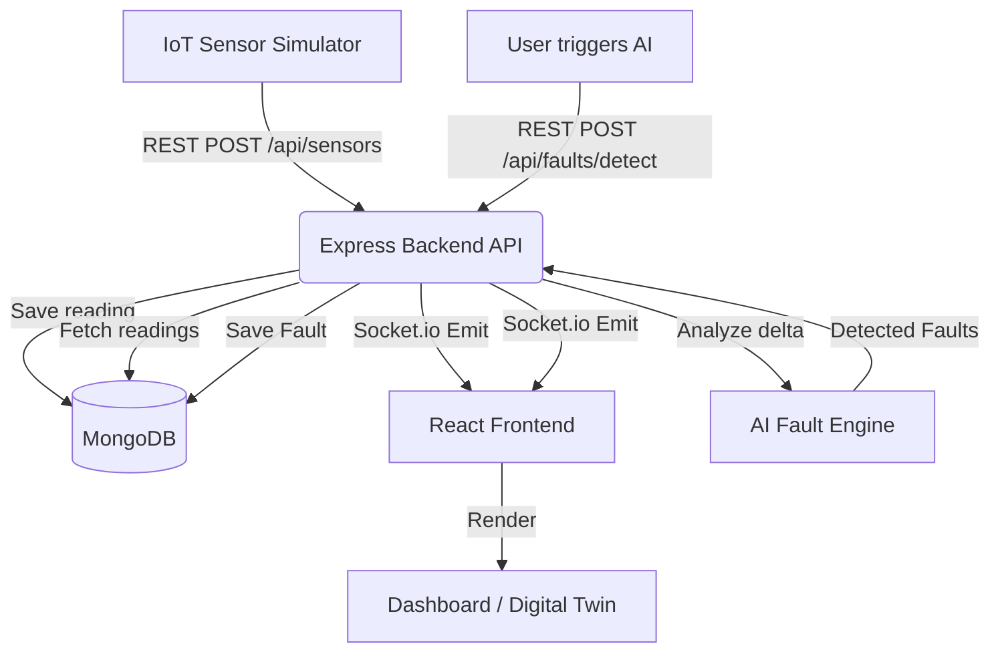

# PoleNova AI - Architecture

## High-Level Data Flow

## Components

### 1. Frontend (React + Vite + TailwindCSS)
- **Role**: Operator dashboard and command center.
- **Key Files**: `Dashboard.jsx`, `NetworkVisualization.jsx`, `AiExplanationPanel.jsx`.
- **State**: Uses React state and Socket.io listeners to maintain a live view of the network without polling.

### 2. Backend (Node.js + Express)
- **Role**: REST API and Socket.io server.
- **Key Files**: `server.js`, `routes/*.js`, `controllers/*.js`.
- **Authentication**: JWT-based authentication with role-based authorization middleware (`protect`, `authorize`).

### 3. Database (MongoDB)
- **Role**: Persistent storage.
- **Collections**: `Users`, `Poles`, `Sensors` (time-series style), `Faults`.
- **Indexes**: Indexed on `pole`, `timestamp`, `status`, and `severity` for performant queries.

### 4. AI Fault Engine
- **Role**: Business logic for anomaly detection.
- **Location**: `backend/services/aiFaultDetection.js`
- **Method**: Sorts poles by `sequenceIndex` on a specific feeder, calculates voltage delta between adjacent poles, and uses heuristics (temperature, current) to assign a root cause and confidence score.

### 5. Sensor Simulator (Digital Twin)
- **Role**: Generates realistic, continuous data streams.
- **Location**: `backend/services/simulationService.js`
- **Control**: Exposed via `/api/simulation/*` endpoints so the frontend can trigger specific hackathon scenarios (e.g., Broken Wire) on demand.
